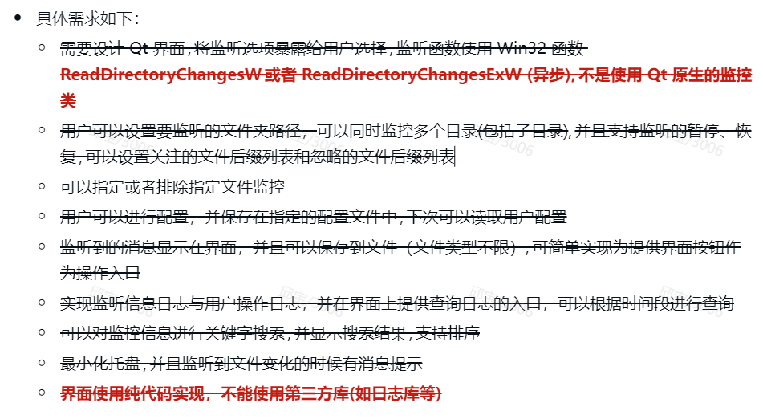

# QtMonitor

文件监控工具

### 实现了如下需求：



### 文件目录：

kdatabase：用于显示监控信息和用户操作信息，以及查询

kdataworker：单独一个工作线程，用于处理数据库操作

kfilemonitor：单独一个线程，文件监控操作

kfilter：实现文件后缀过滤器

mainwindow：用户主界面以及信息交互

### kdatabase：

用到了sqlite数据库，所以每次监控一个信息就要插入一条信息到数据库，开始的时候，我还寻思着，插入一条就在表格中显示一条，不过在跑10000条的时候，卡的进行不下去，之后也查阅了一些解决方法，但是有些复杂，什么异步、批处理，我都没有很好的想法和我的项目连接，最后就提供一个按钮，点击一次，就加载数据库的数据到表格，这样就不卡顿了。


我还学会使用那个时间部件，这样用户就可以按照我指定的方式去输入时间，不会有其他错误输入


关键词搜索也就只是搜索Action和file里的数据

### kdataworker：

这里我用到了多线程，因为如果边监控信息，边插入数据，会比较卡，所以专门用一个工作线程去执行数据库操作。

### kfilemonitor：

加载配置文件/保存配置文件：这里我使用Qsetting保存配置信息，并保存为ini文件

后缀过滤器：这里我会有两个变量存储后缀，在检测到文件时，会进行比较，查看文件后缀是否在相应的设置中

### kfilter：

这里是有几个组件，这样可以直接获取界面中的数据进行处理，用户需要输入形如这样的后缀："txt,jpg,docx,"，最后也可以不用加逗号，两种方式都可，这样用户就可以任意输入，会有一定的风险，但是用户可以自定义设置后缀

### mainwindow：

这里我没有过多封装，所以这个类的压力有些大，而且主要的界面设计在这里，以及类之间的信息交互，这里我实现了树形视图的文件，这样用户可以直接选择文件，但是这里只能对单个文件进行监控，之前我也尝试改成多个文件监控，但是报错了我就回退回来做其他的了。

### 内存泄漏：

```c++
---------- Block 9 at 0x000000000BE4A820: 16 bytes ----------
  Leak Hash: 0x353495F9, Count: 1, Total 16 bytes
  Call Stack (TID 22680):
    ucrtbased.dll!malloc()
        
d:\agent\_work\5\s\src\vctools\crt\vcstartup\src\heap\new_scalar.cpp (35): QtMonitor.exe!operator new() + 0xA bytes
    D:\QT\Develop-Training\QtMonitor\mainwindow.cpp (18): QtMonitor.exe!MainWindow::MainWindow() + 0xA bytes
    D:\QT\Develop-Training\QtMonitor\main.cpp (8): QtMonitor.exe!main() + 0xC bytes
    D:\SchoolCode\vcpkg\buildtrees\qt5-base\src\5.15.11-13623e1e19.clean\src\winmain\qtmain_win.cpp (97): QtMonitor.exe!WinMain() + 0xE bytes
    d:\agent\_work\5\s\src\vctools\crt\vcstartup\src\startup\exe_common.inl (107): QtMonitor.exe!invoke_main()
    d:\agent\_work\5\s\src\vctools\crt\vcstartup\src\startup\exe_common.inl (288): QtMonitor.exe!__scrt_common_main_seh() + 0x5 bytes
    d:\agent\_work\5\s\src\vctools\crt\vcstartup\src\startup\exe_common.inl (331): QtMonitor.exe!__scrt_common_main()
    d:\agent\_work\5\s\src\vctools\crt\vcstartup\src\startup\exe_winmain.cpp (17): QtMonitor.exe!WinMainCRTStartup()
    KERNEL32.DLL!BaseThreadInitThunk() + 0x14 bytes
    ntdll.dll!RtlUserThreadStart() + 0x21 bytes
  Data:
    68 86 36 1A    F6 7F 00 00    E0 45 E6 0B    25 01 00 00     h.6..... .E..%...
```

这里我是没有很好管理动态内存，在构造函数中new了，但是并没有delete，所以在析构函数中delete这些之后就可以了

```c++
---------- Block 93 at 0x0000000010956690: 48 bytes ----------
  Leak Hash: 0x3CD631CA, Count: 1, Total 48 bytes
  Call Stack (TID 22680):
    ucrtbased.dll!malloc()
    d:\agent\_work\5\s\src\vctools\crt\vcstartup\src\heap\new_scalar.cpp (35): QtMonitor.exe!operator new() + 0xA bytes
    D:\QT\Develop-Training\QtMonitor\mainwindow.cpp (120): QtMonitor.exe!MainWindow::MainWindow() + 0xA bytes
    D:\QT\Develop-Training\QtMonitor\main.cpp (8): QtMonitor.exe!main() + 0xC bytes
    D:\SchoolCode\vcpkg\buildtrees\qt5-base\src\5.15.11-13623e1e19.clean\src\winmain\qtmain_win.cpp (97): QtMonitor.exe!WinMain() + 0xE bytes
    d:\agent\_work\5\s\src\vctools\crt\vcstartup\src\startup\exe_common.inl (107): QtMonitor.exe!invoke_main()
    d:\agent\_work\5\s\src\vctools\crt\vcstartup\src\startup\exe_common.inl (288): QtMonitor.exe!__scrt_common_main_seh() + 0x5 bytes
    d:\agent\_work\5\s\src\vctools\crt\vcstartup\src\startup\exe_common.inl (331): QtMonitor.exe!__scrt_common_main()
    d:\agent\_work\5\s\src\vctools\crt\vcstartup\src\startup\exe_winmain.cpp (17): QtMonitor.exe!WinMainCRTStartup()
    KERNEL32.DLL!BaseThreadInitThunk() + 0x14 bytes
    ntdll.dll!RtlUserThreadStart() + 0x21 bytes
  Data:
    D8 91 36 1A    F6 7F 00 00    50 67 9F 10    25 01 00 00     ..6..... Pg..%...
    98 93 36 1A    F6 7F 00 00    00 00 CD CD    CD CD CD CD     ..6..... ........
    00 00 00 00    00 00 00 00    70 68 9F 10    25 01 00 00     ........ ph..%...
```

这里也是因为没有很好的管理动态空间，有些在构造函数中声明的指针没有得到释放

```c++
//改之前：
QMenu* trayMenu = new QMenu();
//改之后：
QMenu* trayMenu = new QMenu(this);
```

这里就是为trayMenu设置父对象，这样Qt就会自动管理这些对象的内存

### 总结展望：

我还有一两个功能没做，或许之后可以补上去，然后对于监控事件再新添文件夹事件，后缀过滤器可以选择使用一种选择的方式而不是填空的方式，这样可以防止用户输入错误，以及方便用户操作。可以看到我的界面并没有美化设计，也没有测试可行性，所以可能一些按钮可能无法遭受高强度的点击，这里可以以后测试并在相应的函数里进行处理。这次我不得不使用线程去处理数据，但是我并不是很熟悉，所以在编写的过程中，有很多次错误，但最终还是编写成功，所以我收获了比较重要的一个知识点，希望之后能够更加全面的学习，并在实际过程中应用。
