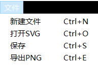
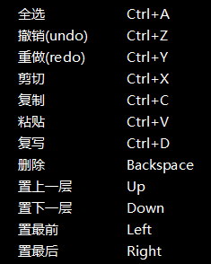

# QtSvg

# KShape

+ 新增函数，用于在改变参数栏的时候设置图形样式

```c++
void setPenWidth(int value);
void setPenStyle(Qt::PenStyle style);
void setPenColor(QString &color);
void setBrushColor(QString& color);
```

+ 新增比例坐标，用于显示图形在画布中的位置，因为在改变比率后，画布就会变化，那么图形的点也要根据比率改变，到时候直接用这种坐标显示，这样图形就可以和画布一样变化

```c++
QPoint getStartPointRate();
QPoint getEndPointRate();
```

+ 新增复制函数，可以将一个图形的属性复制给另一个同样类型的图形，用于后面菜单栏的复制

```c++
void copy(KShape* shape);
```

+ 新增QPen和QBrush，用于改变图形样式

```c++
QPen m_pen;
QBrush m_brush;
```

+ 改变了构造函数，方便后面保存为svg时使用的是同一个QPainter

```c++
virtual void drawShape(QPaintDevice *parent = Q_NULLPTR ,QPainter *painter = nullptr) = 0;
```

还有其他适配的函数，用于获得和变化。

## KPen

这个线当时并没有看课件，就自己做了，就是在触发鼠标事件的时候把过程中的点添加到容器中，最后显示的时候，把这些点连起来就可以了，不过这里我没有想好如何在放大缩小的时候随之改变，我想难道要增加新的点之类，就没再想了。

## KHexa、KPent、KStar

像五边形、六边形、星型，都是根据图形特性，矩形的左上坐标和右下坐标，算出其他的坐标。不过这里我以为是要画出正的五边形和六边形就弄的有些不适配，不过方法都是一样的。

# 左上角菜单栏



+ 我写在KMainWindow中，下方是一个简单的实现一个选项的写法，并连接了槽函数onNewFile

```c++
QAction* newFileAction = new QAction(QString::fromLocal8Bit("新建文件"), this);
newFileAction->setShortcut(QKeySequence("Ctrl+N"));
m_pMenu->addAction(newFileAction);

(void)connect(m_pMenu->actions().at(0), &QAction::triggered, this, &KMainWindow::onNewFile);
```

## 新建文件

就是一个清空画布的操作，并重置画布的各种属性

```c++
void KCanvas::clear()
{
	m_pCurrentShape = Q_NULLPTR;
	m_TransType = KTransType::None;
	m_isDrawing = false;
	m_isLPress = false;
	m_isSelected = false;
	m_isImage = false;
	m_label.hide();
	m_pShapeList.clear();
	setStyleSheet("background-color:#FFFFFF");
	KGlobalData::getGlobalDataIntance()->setCanvasColor("FFFFFFFF");
	update();
}
```

## 打开SVG

这里就是打开文件，但是是贴图片，所以这里并不能编辑

```c++
void KMainWindow::openSvgFile()
{
	QString fileName = QFileDialog::getOpenFileName(this, QString::fromLocal8Bit("打开SVG文件"), "", "SVG Files (*.svg)");
	if (!fileName.isEmpty())
	{
		QSvgRenderer renderer(fileName);

		QImage image(m_pSvgMainWin->m_pCanvas->size(), QImage::Format_ARGB32);
		//image.fill(Qt::transparent);

		QPainter imagePainter(&image);
		renderer.render(&imagePainter);
		imagePainter.end();

		m_pSvgMainWin->m_pCanvas->setSvgImage(image);
		m_pSvgMainWin->m_pCanvas->update();
	}
}
```

## 保存

之前因为drawShape里都有各自的QPainter，所以不能画多个图形，之后就重构了一下drawShape，可以传入QPainter，这里大段代码是用来设置背景颜色的。

```c++
void KMainWindow::saveSvgFile()
{
	QString fileName = QFileDialog::getSaveFileName(this, QString::fromLocal8Bit("保存SVG文件"), "", "SVG Files (*.svg)");
	if (!fileName.isEmpty())
	{
		// 创建一个QSvgGenerator对象来生成SVG文件
		QSvgGenerator generator;
		generator.setFileName(fileName);
		generator.setSize(QSize(KGlobalData::getGlobalDataIntance()->getCanvasWidth(), KGlobalData::getGlobalDataIntance()->getCanvasHeight())); // 设置SVG文件的大小
		generator.setViewBox(QRect(0, 0, KGlobalData::getGlobalDataIntance()->getCanvasWidth()
			* KGlobalData::getGlobalDataIntance()->getCanvasScale(), 
			KGlobalData::getGlobalDataIntance()->getCanvasHeight()
			* KGlobalData::getGlobalDataIntance()->getCanvasScale())); // 设置SVG文件的视图框
		
		QPainter painter(&generator);
		painter.setBrush(KShape::toRgb(KGlobalData::getGlobalDataIntance()->getCanvasColor()));
		painter.drawRect(0, 0, KGlobalData::getGlobalDataIntance()->getCanvasWidth()
			* KGlobalData::getGlobalDataIntance()->getCanvasScale(),
			KGlobalData::getGlobalDataIntance()->getCanvasHeight()
			* KGlobalData::getGlobalDataIntance()->getCanvasScale());
		QList <KShape*> shapeList = m_pSvgMainWin->m_pCanvas->getShapeList();
		if (!shapeList.isEmpty())
		{
			auto it = shapeList.rbegin();
			while (it != shapeList.rend())
			{
				(*it)->drawShape(&generator,&painter);
				it++;
			}
		}
		
		painter.end();
	}
}
```

## 导出PNG

```c++
void KMainWindow::saveAsPng() {
	QString fileName = QFileDialog::getSaveFileName(this, QString::fromLocal8Bit("保存PNG文件"), "", "PNG Files (*.png)");
	if (!fileName.isEmpty())
	{
		// 创建一个QImage对象，使用设备的大小和颜色格式
		QImage image(m_pSvgMainWin->m_pCanvas->size(), m_pSvgMainWin->m_pCanvas->colorCount() == 32 ? QImage::Format_ARGB32 : QImage::Format_RGB32);

		// 创建一个QPainter对象，用于在QImage上绘制
		QPainter painter(&image);
		m_pSvgMainWin->m_pCanvas->render(&painter); // 将设备的内容渲染到QPainter上

		// 结束绘制并保存为PNG文件
		painter.end();
		image.save(fileName);
	}
}
```

# 参数栏

这里新增一种KStylebox，用于显示画笔的样式，像是点线，这里使用QcomBox来实现

```c++
m_pStylePen = new QComboBox(this);
m_pStylePen->addItem(QString::fromLocal8Bit("  —"));
m_pStylePen->addItem("  - -");
m_pStylePen->addItem("  . .");
m_pStylePen->setStyleSheet("background-color:#3f3f3c; font-size:20px; color:#4f80ff; font-family: Microsoft YaHei; font-weight: bold; border-width:0; border-style:outset");
m_pStylePen->setCurrentIndex(0);

m_pVLayout->addWidget(m_pStylePen);// 加入到布局中 m_pVLayout 设置在父类中
```

其他参数栏和之前一样，只是新添而已

+ 在Kmainwindow里添加连接信号，槽函数里设置全局变量，并修改选中图形的属性，这样到时候图形重画可以改变样式。

# 右键菜单栏



## 全选

这里我就是简单的显示所有图形的矩形，并不能移动

## 撤销和重做未做

## 剪切

首先要选择一个图形，所以先检测是否有选择，并在列表中找到这个图形，从列表中删除这个图形，并存储到另一个地方，方便粘贴

```c++
void KCanvas::onCut()
{
	if (m_pCurrentShape != Q_NULLPTR)
	{
		QList<KShape*>::iterator it = m_pShapeList.begin();
		for (; it != m_pShapeList.end(); ++it) {
			if ((*it)->getStartPoint() == m_pCurrentShape->getStartPoint()
				&& (*it)->getEndPoint() == m_pCurrentShape->getEndPoint()
				&& (*it)->getShapeType() == m_pCurrentShape->getShapeType()) {
				m_pShapeList.erase(it);
				m_isSelected = false;
				break;
			}
		}
		update();
		m_pasteShape = m_pCurrentShape;
		m_pCurrentShape = Q_NULLPTR;
	}
}
```

## 复制

相较于剪切，复制就不用从列表中删除图形，直接获得图形的属性，并新建一个

## 粘贴

要先复制或是剪切，让变量有对象，然后直接添加到列表中，显示出来

## 复写

复写就是直接复制粘贴选中的图形，就是直接调用复制和粘贴

## 删除

这里在列表中找到选择的图形，并从列表中删除掉该图形，并释放空间

## 置上一层

就是在列表中将选择图形的顺序调后，后显示在画布中就不会被覆盖，但是这里只是调一个位置，所以有些时候由于顺序问题，要多操作几次才能不被覆盖

## 置下一层

把顺序调前，提前显示

## 置最前

把位置调到最前，最后显示

## 置最后

把位置调到最后，最先显示
